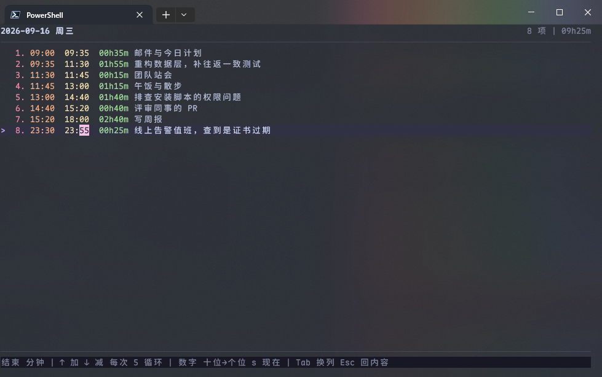
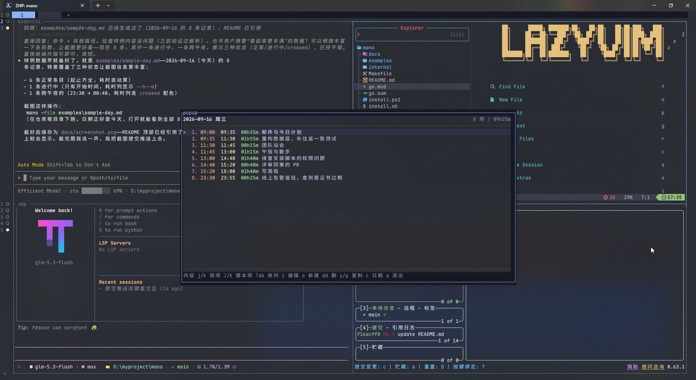

# mano

[](https://github.com/ParadiseWitch/mano/actions/workflows/ci.yml)

一个个人日志TUI程序。

像程序日志一样记录自己的各项事务和耗时。

<p align="center">
  
  
</p>

## 安装

### 脚本安装

macOS / Linux：

```sh
curl -fsSL https://raw.githubusercontent.com/ParadiseWitch/mano/main/install.sh | bash
```

Windows PowerShell：

```powershell
irm https://raw.githubusercontent.com/ParadiseWitch/mano/main/install.ps1 | iex
```

### 下载二进制

从 [Releases](https://github.com/ParadiseWitch/mano/releases) 下载对应平台的文件：

| 平台                  | 文件                     |
| --------------------- | ------------------------ |
| macOS (Apple Silicon) | `mano-darwin-arm64`      |
| macOS (Intel)         | `mano-darwin-amd64`      |
| Linux x64             | `mano-linux-amd64`       |
| Linux arm64           | `mano-linux-arm64`       |
| Windows x64           | `mano-windows-amd64.exe` |

macOS：

```sh
chmod +x mano-darwin-arm64
sudo mv mano-darwin-arm64 /usr/local/bin/mano
```

Windows PowerShell：

```powershell
Move-Item mano-windows-amd64.exe $HOME\bin\mano.exe
```

### 从源码构建

需要 Go 1.24 或更新版本。

```sh
git clone https://github.com/ParadiseWitch/mano.git && cd mano
make build                       # 产物在 dist/mano
cp dist/mano /usr/local/bin/     # 或任何在 PATH 里的目录
```

交叉编译 Windows 版本（在 macOS/Linux 上也能构建）：

```sh
make build-windows   # 产物在 dist/mano-windows-amd64.exe
```

### 更新与卸载

装好之后：

```sh
mano version      # 打印版本号
mano update       # 检查最新 Release，下载校验后替换自身
mano uninstall    # 删除 mano 本体（会先确认；日志与配置保留）
```

## 运行

```sh
mano                       # 打开今天的日志
mano -v                    # 打印版本号（-version 同效，子命令 version 亦可）
mano -date 2026-08-01      # 打开指定日期，也可写 20260801
mano -file ~/notes/time.md # 换一个数据文件
```

## 开发

```sh
make test    # go test ./...
make vet     # go vet ./...
make fmt     # gofmt -w .
make dist    # 同时构建本机版和 Windows 版
make clean   # 删掉 dist/
```
